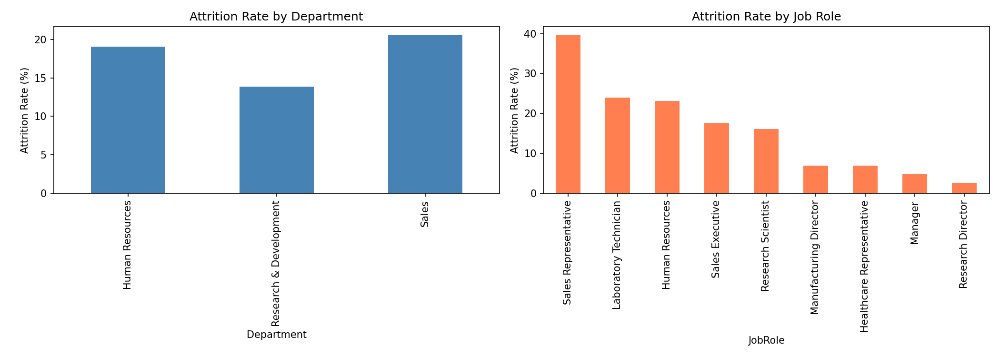
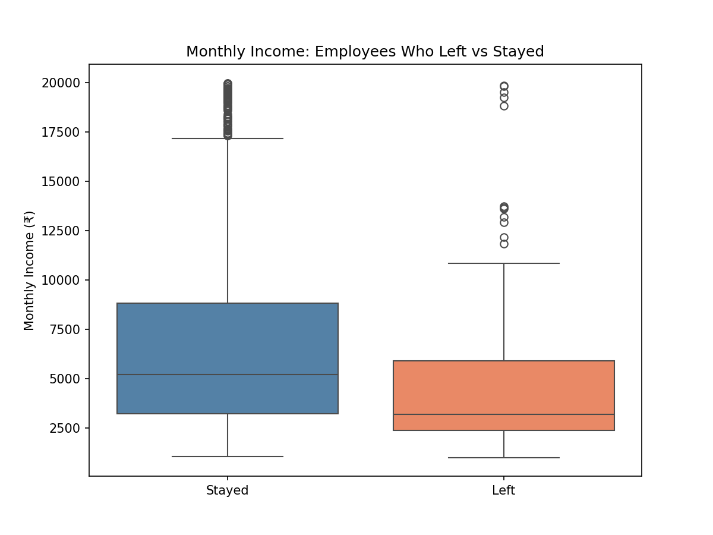
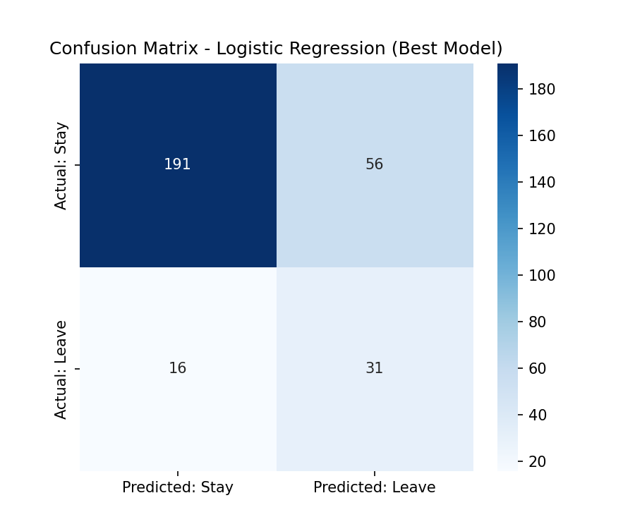
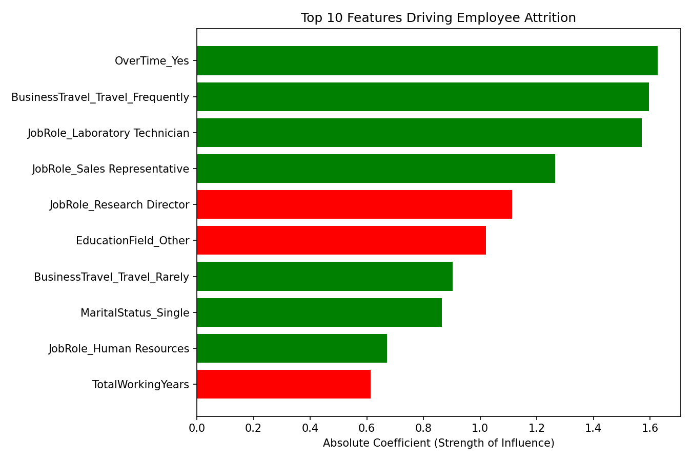
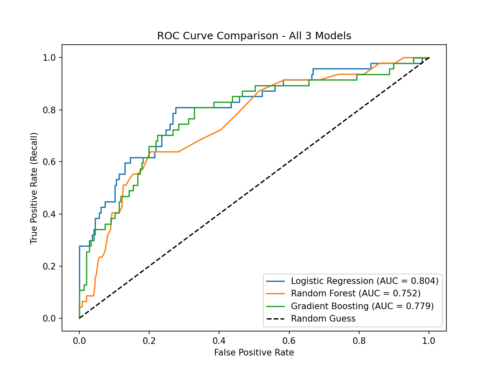

# Employee Attrition Prediction using Machine Learning

Predicting which employees are likely to leave a company, using the IBM HR Analytics Employee Attrition dataset — and translating the results into plain-language recommendations a non-technical HR team can act on.

> 16.1% of employees in this dataset left the company. The best model in this project catches about **66% of actual leavers** before they resign, and the analysis points to three concrete drivers: overtime, frequent travel, and job role.

---

## Table of Contents

- [Overview](#overview)
- [Dataset](#dataset)
- [Project Workflow](#project-workflow)
- [Key Findings](#key-findings)
- [Model Performance](#model-performance)
- [Visualizations](#visualizations)
- [HR Recommendations](#hr-recommendations)
- [Tech Stack](#tech-stack)
- [Repository Structure](#repository-structure)
- [How to Run](#how-to-run)
- [Limitations](#limitations)

---

## Overview

Every company loses employees — the goal isn't to stop attrition entirely, it's to know **who** is at risk and **why**, early enough to do something about it. This project builds a full pipeline that:

1. Cleans and prepares raw HR data
2. Explores the data to surface real, numbers-backed patterns
3. Trains and compares 3 classification models
4. Identifies which factors actually drive attrition
5. Converts all of it into recommendations a non-technical HR Director can act on

---

## Dataset

**Source:** [IBM HR Analytics Employee Attrition Dataset](https://www.kaggle.com/datasets/pavansubhasht/ibm-hr-analytics-attrition-dataset) (Kaggle)

- **1,470 employees** × **35 original features**
- Target variable: `Attrition` (Yes/No)
- Features include demographics, compensation, satisfaction ratings, job role, tenure, and work conditions

---

## Project Workflow

| Step | What Was Done |
|---|---|
| **1. Data Exploration** | Loaded data, checked shape, identified target, calculated attrition rate |
| **2. Data Cleaning** | Removed constant/ID columns, encoded categoricals (one-hot), scaled numeric features (StandardScaler) |
| **3. Exploratory Data Analysis** | Analyzed attrition by department, job role, income, work-life balance, and tenure |
| **4. Model Building** | Trained Logistic Regression, Random Forest, and Gradient Boosting with class-imbalance handling |
| **5. Model Evaluation** | Compared models on Precision, Recall, F1, ROC-AUC; extracted feature importance |
| **6. Visualization** | Built 5 charts covering distributions, model performance, and feature drivers |
| **7. Business Recommendations** | Translated findings into a one-page, jargon-free HR summary |

---

## Key Findings

- **Department:** Sales has the highest attrition *rate* (20.6%), but R&D loses the most employees overall (~133 people) simply because it's the company's largest department.
- **Job Role:** Sales Representatives leave at the highest rate of any role (39.8% — nearly 2 in 5). Laboratory Technicians are the second-highest risk role (23.9%) and, due to R&D's size, account for the largest number of actual departures.
- **Income:** Employees who left earned a median of ₹3,202/month vs. ₹5,204/month for those who stayed (~62%) — but this gap is largely explained by job role, not pay alone.
- **Work-Life Balance:** Employees reporting poor work-life balance are a small group (80 people) but leave at nearly **double** the company average (31.3% vs. 16.1%).
- **Tenure:** Attrition is highest in the first 2 years (28.9%) and drops steadily to 8.1% for employees with 10+ years — roughly a **3.5x** difference.
- **Strongest single predictor (from the model):** Working overtime — a bigger driver than salary, department, or tenure.


---

## Model Performance

Three models were trained with class-imbalance handling (`class_weight='balanced'` for Logistic Regression and Random Forest; `sample_weight` via `compute_sample_weight` for Gradient Boosting, since it has no native `class_weight` parameter).

| Model | Precision | Recall | F1-Score | ROC-AUC |
|---|---|---|---|---|
| **Logistic Regression** ⭐ | 0.356 | **0.660** | 0.463 | **0.804** |
| Random Forest | 0.375 | 0.064 | 0.109 | 0.752 |
| Gradient Boosting | 0.407 | 0.468 | 0.436 | 0.779 |

**Best model: Logistic Regression** — selected for highest Recall and ROC-AUC, not just the highest accuracy. In an imbalanced, high-stakes problem like attrition, missing an at-risk employee (a false negative) is more costly than flagging someone who was never going to leave (a false positive) — so Recall was prioritized over Precision when picking a winner. Logistic Regression is also the most interpretable of the three, which matters when results need to be explained to a non-technical audience.

**Top 5 features driving attrition (by model coefficient):**

| Rank | Feature | Effect |
|---|---|---|
| 1 | OverTime = Yes | ↑ increases risk |
| 2 | Travels Frequently | ↑ increases risk |
| 3 | Job Role: Laboratory Technician | ↑ increases risk |
| 4 | Job Role: Sales Representative | ↑ increases risk |
| 5 | Job Role: Research Director | ↓ decreases risk |

---

## Visualizations

<!-- Replace each placeholder below with your actual screenshot, e.g.  -->

**1. Attrition Rate by Department & Job Role**


**2. Monthly Income — Employees Who Left vs. Stayed**


**3. Confusion Matrix — Best Model (Logistic Regression)**


**4. Top 10 Feature Importances**


**5. ROC Curve — All 3 Models Compared**


---

## HR Recommendations

1. **Treat sustained overtime as an early-warning sign.** Flag employees with consistent overtime for a workload review or manager check-in before burnout drives them to resign.
2. **Run targeted, not blanket, retention conversations.** Prioritize the ~80 employees reporting poor work-life balance and employees in the Sales Representative / Laboratory Technician roles — these are small, well-defined groups with outsized risk, not a problem requiring a company-wide policy change.


---

## Tech Stack

| Tool | Purpose |
|---|---|
| Python 3.x | Core language |
| Pandas / NumPy | Data loading, cleaning, numeric operations |
| Scikit-learn | Preprocessing, model training, evaluation |
| Matplotlib / Seaborn | Visualization |
| Jupyter Notebook / Google Colab | Development environment |

---

## Repository Structure

```
EmployeeAttrition_YourName/
├── analysis.ipynb          # Full notebook — all 7 tasks, code + commentary
├── HR_Attrition.csv        # Dataset used
├── charts/
│   ├── chart1_dept_role_attrition.png
│   ├── chart2_income_boxplot.png
│   ├── chart3_confusion_matrix.png
│   ├── chart4_feature_importance.png
│   └── chart5_roc_curve.png
└── README.md
```

---

## How to Run

```bash
# Clone the repo
git clone https://github.com/<your-username>/<your-repo-name>.git
cd <your-repo-name>

# Install dependencies
pip install pandas numpy scikit-learn matplotlib seaborn

# Open the notebook
jupyter notebook analysis.ipynb
```
Or open `analysis.ipynb` directly in [Google Colab](https://colab.research.google.com/).

---

## Limitations

- The model is trained on a single historical snapshot — if company policies, pay structures, or the workforce change, it will need to be retrained on fresh data to stay accurate.
- Recall is ~66%, meaning roughly 1 in 3 actual leavers are missed. The model should be used as a **prioritization tool** for retention conversations, not a definitive list of who will leave.
- Findings describe **correlation**, not proven causation — e.g., lower pay is associated with attrition, but overlaps heavily with job role, so the true causal driver is harder to isolate from this dataset alone.

---

*Built as part of a Week 2 Data Science Internship project.*
